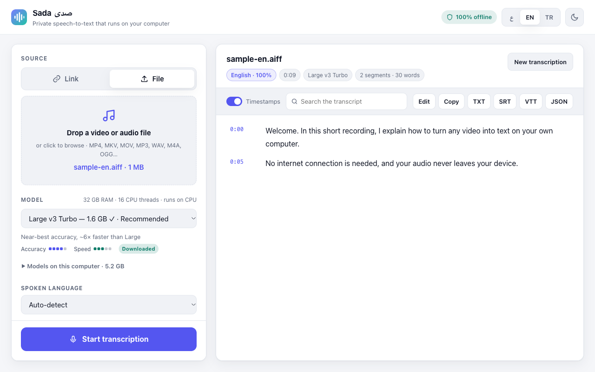
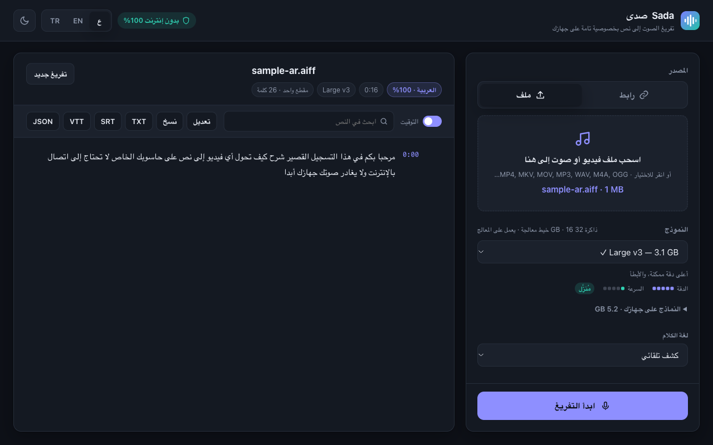
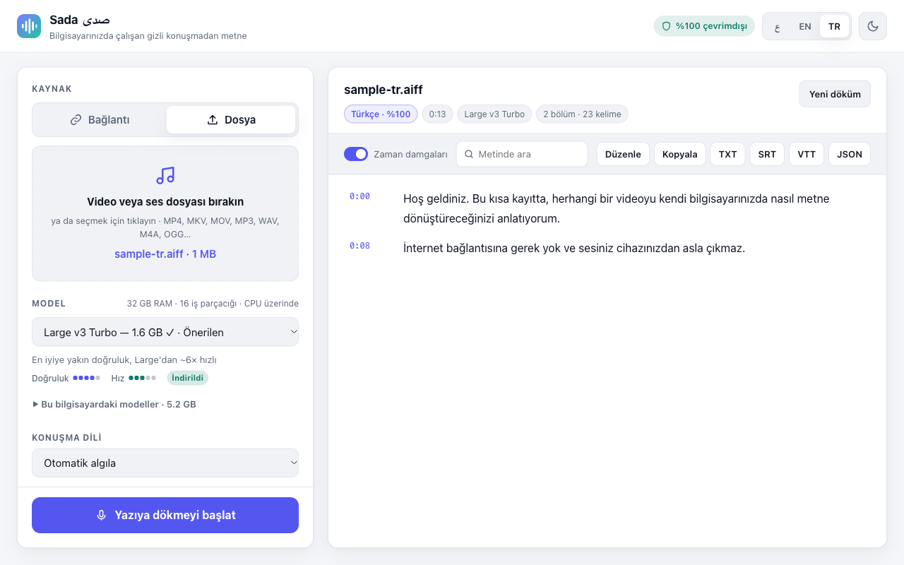

<div align="center">


# Sada · صدى

**Private, offline speech-to-text for Windows, macOS and Linux.**
Paste a link from YouTube, TikTok, Instagram, X, Facebook… or drop any video/audio file, and get an accurate transcript in 99 languages without leaving your computer.

[English](#english) · [العربية](#العربية) · [Türkçe](#türkçe)



</div>

---

## English

### Features
- **100% local**: no API and no account. Audio is transcribed on your machine with [faster-whisper](https://github.com/SYSTRAN/faster-whisper), a CTranslate2 build of OpenAI Whisper that is up to 4× faster and int8-quantized for normal CPUs.
- **Links from 1,000+ sites** via [yt-dlp](https://github.com/yt-dlp/yt-dlp). Only the audio stream is downloaded.
- **Files**: MP4, MKV, MOV, WEBM, MP3, WAV, M4A, OGG, FLAC… Decoding uses the bundled FFmpeg (PyAV), so there is nothing extra to install.
- **Automatic language detection** across the 99 Whisper languages, or pick a language yourself.
- **Choose a model for your hardware**: the app reads your RAM/GPU and recommends one.
- **Live transcript** with timestamps. Export to **TXT, SRT, VTT, JSON** or copy to the clipboard.
- **History on your computer**: every transcript is saved automatically (also one you stopped halfway), so closing the app loses nothing. Open it later to **search** it or **fix words** by editing the lines in place. Timestamps stay intact, so exported subtitles stay in sync.
- Voice-activity detection skips silence, which makes transcription faster and cuts hallucinations.
- **Stop at any time**, even halfway through a multi-GB model download. Settings stay locked while a job runs.
- **Manage models**: see how much space each downloaded model really uses and delete it with one click. Downloaded or uploaded media is temporary and removed after each job.
- The device line (RAM, CPU threads, CPU/GPU) is read from your operating system at runtime. Nothing is hard-coded.
- Interface in **Arabic (RTL), English and Turkish**, with dark and light themes.

| Model | Download | Accuracy | Speed | Good for |
|---|---|---|---|---|
| Tiny | 75 MB | ★☆☆☆☆ | ★★★★★ | very weak devices, quick drafts |
| Base | 145 MB | ★★☆☆☆ | ★★★★★ | 4 GB RAM laptops |
| Small | 485 MB | ★★★☆☆ | ★★★★☆ | most laptops (8 GB RAM) |
| **Large v3 Turbo** | 1.6 GB | ★★★★☆ | ★★★☆☆ | 16 GB RAM / NVIDIA GPU: best value |
| Large v3 | 3.1 GB | ★★★★★ | ★☆☆☆☆ | maximum accuracy |

Each model downloads once, the first time you use it. After that, everything works offline. Linking to a video obviously needs internet to fetch that video.

### Download
Get the latest build for your OS from **[Releases](https://github.com/Mereyani/sada/releases)**, unzip it and run **Sada**.
- **macOS**: the app isn't notarized. The first time, right-click it and choose **Open**, or run `xattr -cr Sada.app`.
- **Windows**: SmartScreen may warn about an unknown publisher. Click *More info → Run anyway*.
- **Linux**: if GTK/Qt WebView isn't installed, Sada opens in your default browser instead.
- **NVIDIA GPU**: used automatically when CUDA 12 + cuDNN 9 are installed. Otherwise Sada runs on the CPU.

### How releases are tested
Every release is built on GitHub Actions for Windows, macOS (Apple Silicon and Intel) and Linux, and the **built app itself** is then tested on each of them ([smoke_frozen.py](smoke_frozen.py)). Starting from an empty model cache, the test checks the following, and nothing is published unless all of it passes:
- the model downloads on first use and a real speech clip is transcribed, with the language detected;
- the transcript is saved to the history on disk, and an edit is saved;
- language, theme and model choice survive quitting and relaunching the app;
- Stop halts a model download mid-way;
- deleting a model frees its disk space;
- the RAM and thread counts match an independent reading from `psutil`.

### Run from source
```bash
git clone https://github.com/Mereyani/sada && cd sada
python -m venv .venv && source .venv/bin/activate   # Windows: .venv\Scripts\activate
pip install -r requirements.txt
python app.py            # native window
python app.py --browser  # or in your browser
```
Build a standalone app: `pip install pyinstaller pillow && python build.py`. Pushing a `v*` tag builds every OS through GitHub Actions.

### How it works
`app.py` is a small stdlib HTTP server bound to `127.0.0.1`, plus a native [pywebview](https://pywebview.flowrl.com/) window. The UI in `web/` is plain HTML/CSS/JS. One background worker downloads the audio with yt-dlp, loads the chosen Whisper model (int8 on CPU, float16 on CUDA), and streams segments back to the UI as they are decoded.

---

<div dir="rtl">

## العربية



**صدى** تطبيق سطح مكتب لتفريغ الصوت إلى نص **على جهازك بالكامل**، بلا API وبلا حساب. يعمل على ويندوز وماك ولينكس.

- الصق **رابطاً** من يوتيوب أو تيك توك أو إنستغرام أو إكس أو فيسبوك أو أكثر من 1000 موقع آخر، ويُحمَّل الصوت فقط. أو **ارفع ملف فيديو أو صوت** مباشرةً.
- **كشف تلقائي للغة** من بين 99 لغة، أو اختر اللغة بنفسك.
- **اختر النموذج المناسب لجهازك**: من Tiny الخفيف جداً إلى Large v3 الأعلى دقة، والتطبيق يقترح الأنسب حسب الذاكرة وكرت الشاشة.
- نص مباشر مع التوقيت، وتصدير بصيغ **TXT وSRT وVTT وJSON**.
- **سجل محفوظ على جهازك**: يُحفظ كل تفريغ تلقائياً، حتى الذي أوقفته في منتصفه، فلا يضيع شيء عند إغلاق التطبيق. يمكنك فتحه لاحقاً، و**البحث** فيه، و**تصحيح الكلمات** بتعديل الأسطر مباشرة دون أن يتغير التوقيت.
- **زر إيقاف يعمل في أي لحظة**، حتى في منتصف تنزيل نموذج حجمه عدة غيغابايت. وتبقى الإعدادات مقفلة أثناء التفريغ.
- **إدارة النماذج**: ترى المساحة الحقيقية لكل نموذج وتحذفه بضغطة. أما ملفات الصوت والفيديو فمؤقتة وتُحذف بعد كل مهمة.
- سطر الجهاز (الذاكرة وخيوط المعالج والمعالج أو كرت الشاشة) يُقرأ من نظام التشغيل مباشرة، وليس رقماً ثابتاً.
- قبل نشر أي إصدار تُختبر النسخة المبنية نفسها آلياً على ويندوز وماك ولينكس.
- واجهة بالعربية والإنجليزية والتركية، مع وضع ليلي ونهاري.

**التشغيل:** حمّل النسخة المناسبة لنظامك من [الإصدارات](https://github.com/Mereyani/sada/releases)، أو شغّله من الكود المصدري بالأوامر الموجودة في القسم الإنجليزي أعلاه. يُنزَّل كل نموذج مرة واحدة عند أول استخدام، وبعدها يعمل التفريغ بدون إنترنت.

</div>

---

## Türkçe



**Sada**, konuşmayı **tamamen bilgisayarınızda** metne çeviren bir masaüstü uygulamasıdır: API yok, hesap yok. Windows, macOS ve Linux'ta çalışır.

- YouTube, TikTok, Instagram, X, Facebook veya 1.000'den fazla siteden **bağlantı** yapıştırın ya da **video/ses dosyası** bırakın.
- 99 dil arasından **otomatik dil algılama**.
- Bilgisayarınızda saklanan **geçmiş**: her döküm otomatik kaydedilir; sonradan açıp **arayabilir** ve satırları düzenleyerek **düzeltebilirsiniz**.
- Cihazınıza göre model seçimi (Tiny → Large v3). Uygulama en uygun modeli önerir.
- Zaman damgalı canlı metin; **TXT, SRT, VTT, JSON** olarak dışa aktarma.
- Arapça, İngilizce ve Türkçe arayüz; koyu ve açık tema.

İndirmek için [Releases](https://github.com/Mereyani/sada/releases) sayfasına gidin.

---

MIT License · Built with faster-whisper, CTranslate2, yt-dlp and pywebview.
